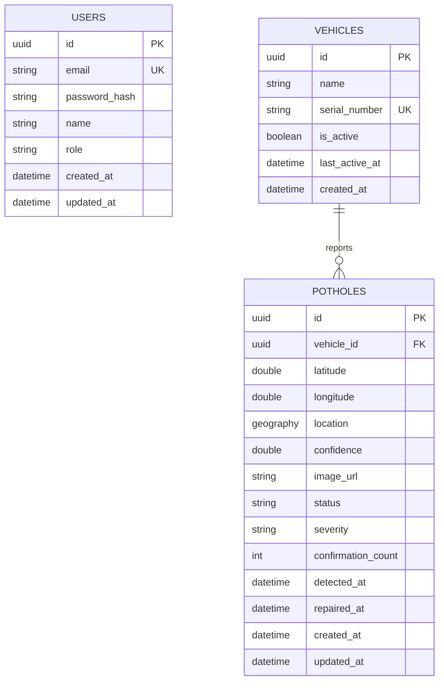

# Database Mermaid Diagram

This Mermaid ER diagram reflects the current backend models and relationships in the repository.

- Source models: `backend/src/PotholeDetection.Api/Models/User.cs`, `backend/src/PotholeDetection.Api/Models/Vehicle.cs`, `backend/src/PotholeDetection.Api/Models/Pothole.cs`
- Relationship note: `vehicles` is currently not linked to `users`; `potholes` keeps a required `vehicle_id` foreign key.

## Notes

- `USERS` exists for authentication and authorization.
- `VEHICLES` stores reporting devices/units and has a unique `serial_number`.
- `POTHOLES.location` is a PostGIS `geography(Point, 4326)` column for spatial queries.
- Indexes are defined on `potholes.status`, `potholes.detected_at`, and `potholes.vehicle_id` in `backend/src/PotholeDetection.Api/Data/AppDbContext.cs`.
